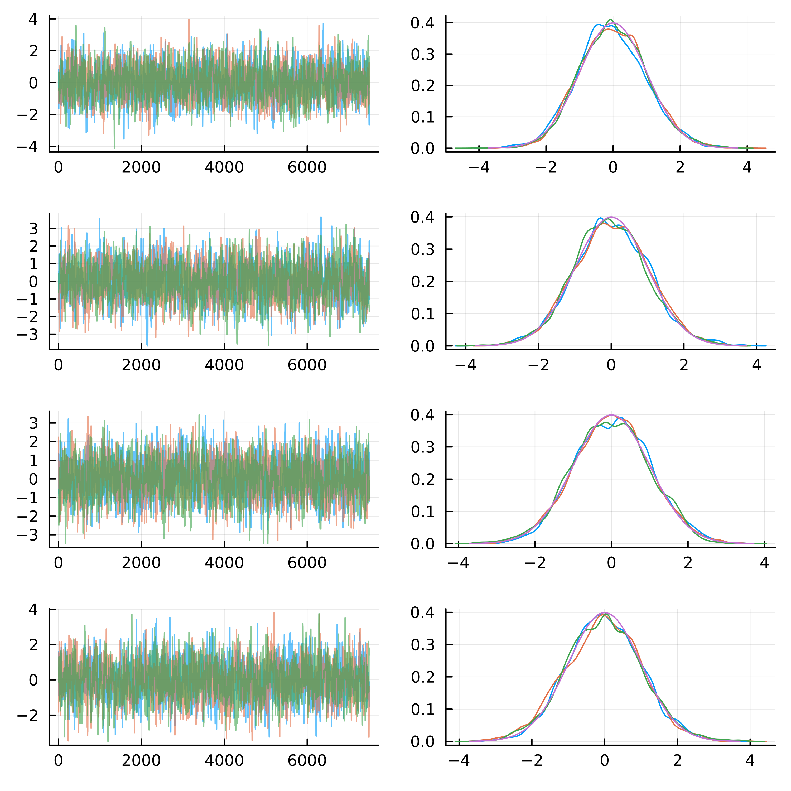
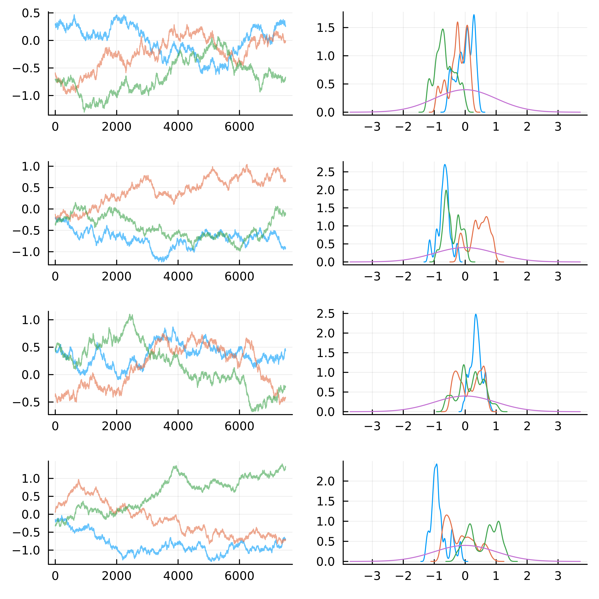

# Implementation of the metropolis algorithm

## Introduction

The Metropolis algorithm is a Markov chain Monte Carlo (MCMC) method which is typically used when the probability density function of a distribution cannot be obtained through analytical methods. The metropolis algorithm essentially generates Markov Chains of correlated samples in which the sample value at n+1 depends on the state of the chain at n. Random samples are generated from the distribution using an acceptance criterion in such a way that the distribution of the samples will approximate the original distribution. This project presents a simple implementation of the Metropolis algorithm in Julia.

## Methods

The target distribution used in this project is the multivariate normal distribution:

$$ X \sim N_k(\mu, \sigma) $$

Since its probability density function is explicitly known, the algorithm's output can be directly compared to the true distribution. Additionally, this distribution comes handy because the dimensionality of the parameter space can be easily adjusted using a single parameter in our code implementation.

The Metropolis algorithm begins by selecting a random starting value $x_i$ often chosen from a uniform distribution. The subsequent value, $x_{i+1}$, is chosen by following these steps:

1. A proposal $x'$ is generated by drawing a random value from a normal distribution centered around the previous value $x_i$ and a standard deviation $\sigma$. In the current simulation, $\sigma$ is set to 1 by default.
2. We next compute the probability $A$ of accepting this new proposal as $A = f(x') / f(x_i)$, where $f$ is the target probability density function.
3. A random number $\mu$ is drawn from a uniform distribution with [0,1] as lower and upper bounds. If $\mu \leq A$, the proposal $x'$ is accepted and $x_{i+1}$ is set to $x'$. Otherwise, $x_{i+1}$ is set to $x_i$.

To assess the performance of the algorithm, we can use different tools. The first one is to plot a the transitions between successive states of the chains and check if they sufficiently explored the parameter space to a similar extent. Another, more objective way to assess convergence is by using a more objective metric. One can compute the $\hat{R}$ index, which compares the variability within individual chains to the variability between chains. An $\hat{R}$ value close to 1 indicates good convergence, meaning that the chains have likely reached the target distribution. It is computed using the following formula:

$$ \sqrt{\hat{V} / W} $$

Where \hat{V} is the marginal posterior variance, given by:

$$ \hat{V} = ((n - 1) / n)W + (1 / n)B $$

In this formula, n is the number of samples in the chain. W and B are the within- and between-chain variances, respectively:

$$ W = 1 / m \sum_{i=1}^m s_{i}^2 $$

$$ B = n s_{m}^2 $$

Hence, the within-variance $W$ is the averaged variance of individual chains, and the between-chain variance $B$ is the variance of the mean of each chain.

## Results

The following plot shows the results from this implementation over a four-dimensional multivariate normal distribution:

These results were obtained by running three independent MCMC chains for 10,000 iterations. Thanks to Julia's JIT compiler, it takes only 20ms to run the algorithm with this amount of iterations. The left and right panels show, respectively, the transitions between successive states and the density distribution produced by the three chains. The right panels also include the density distribution of the original function for comparison. Each row from top to bottom corresponds to a different parameter of the function. As can be seen, the density lines generated by the Metropolis algorithm largely overlap with those from the original function, suggesting a good approximation.

We can check if the chains converged, by looking at the $\hat{R}$ index for each parameter:

| Parameter | $\hat{R}$ |
| --------- | --------- |
| 1         | 1.0001    |
| 2         | 1.0023    |
| 3         | 1.0       |
| 4         | 1.0002    |

As can be seen, all $\hat{R}$ values are very close to 1, suggesting good convergence. Running the chains with more samples would improve these values further.

We can now check what happens when we reduce the $\sigma$ value to 0.01, which strongly determines the value of the next proposal:

As shown in the figure, the chains perform very little exploration of the parameter space. As such, the density plots indicate that the density distribution of the chains do not recover the original shape of the normal distribution. A closer look at the $\hat{R}$ values indicate a lack of convergence between chains:

| Parameter | $\hat{R}$ |
| --------- | --------- |
| 1         | 1.4856    |
| 2         | 2.3648    |
| 3         | 1.0559    |
| 4         | 1.9991    |

The choice for $\sigma$ is therefore critical when running the Metropolis algorithm.

## Conclusion

The results from these simulations illustrate the core principles of the Metropolis algorithm. By generating a Markov chain of correlated samples, the algorithm allows the approximation of complex probability distributions even when their density functions cannot be computed analytically. The choice of parameters, such as $\sigma$, plays a crucial role to get proper exploration of the parameter space and convergence to the target distribution. When tuned appropriately, the algorithm provides an efficient way to generate representative samples.
