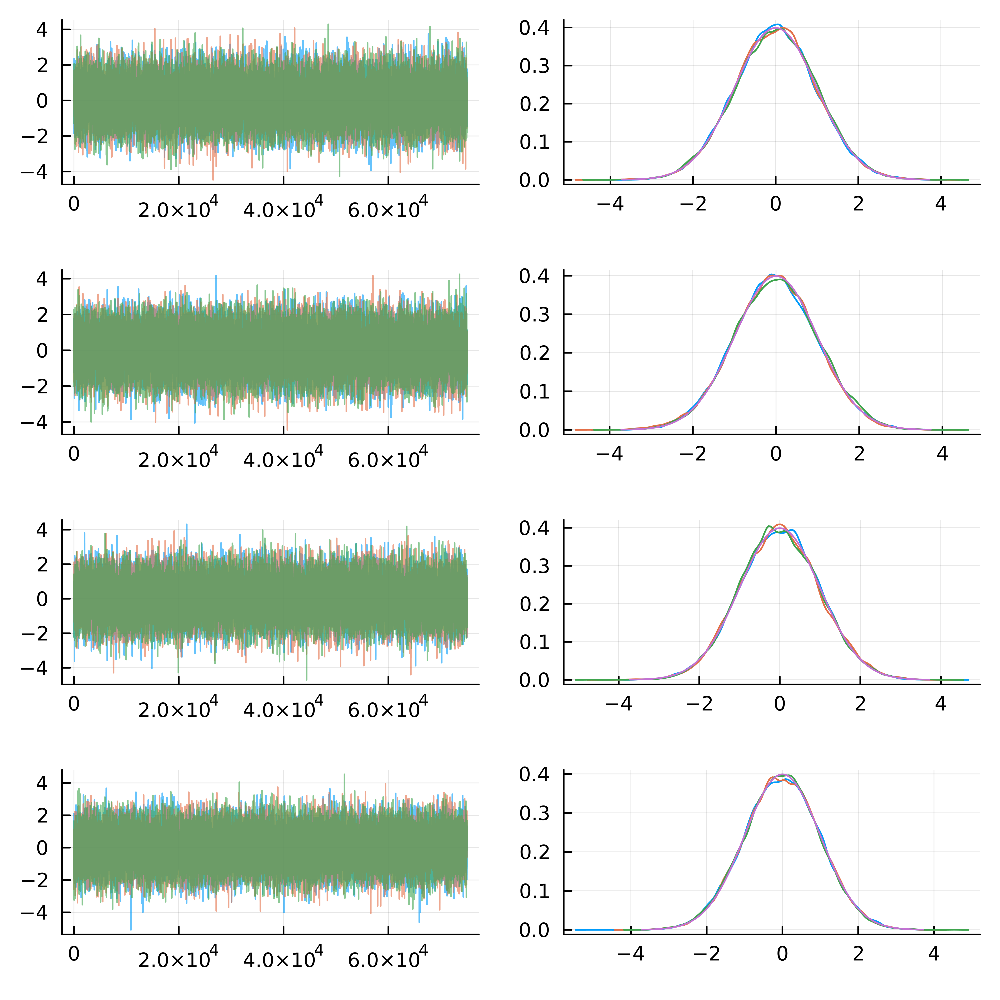

# Implementation of the metropolis algorithm

## Introduction

The Metropolis algorithm is a Markov chain Monte Carlo (MCMC) method which is typically used when the probability density function of a distribution cannot be obtained through analytical methods. The metropolis algorithm essentially generates Markov Chains of correlated samples in which the sample value at n+1 depends on the state of the chain at n. Random samples are generated from the distribution using an acceptance criterion in such a way that the distribution of the samples will approximate the original distribution. This project presents a simple implementation of the Metropolis algorithm in Julia.

The target distribution used in this project is the multivariate normal distribution:

$$ X ~ N_k(\mu, \sigma) $$

Since its probability density function is explicitly known, the algorithm's output can be directly compared to the true distribution. Additionally, this distribution comes handy because the dimensionality of the parameter space can be easily adjusted using a single parameter in our code implementation.

The Metropolis algorithm begins by selecting a random starting value $x_i$ often chosen from a uniform distribution. The subsequent value, $x_{i+1}$, is chosen by following these steps:

1. A proposal * x' $ is generated by drawing a random value from a normal distribution centered around the previous value $x_i$.
2. We next compute the probability $ A $ of accepting this new proposal as $ A = f(x') / f(x_i) $, where $f$ is the target probability density function.
3. A random number $\mu$ is drawn from a uniform distribution with [0,1] as lower and upper bounds. If $\mu <= A$, the proposal $x'$ is accepted and $x_{i+1}$ is set to $x'$. Otherwise, $x_{i+1}$ is set to $x_i$.

The following plot shows the results from this implementation over a four-dimensional multivariate normal distribution:

These results were obtained by running three independent MCMC chains for 10,000 iterations. The left and right panels show, respectively, the transitions between successive states and the density distribution produced by the three chains. The right panels also include the density distribution of the original function for comparison. Each row from top to bottom corresponds to a different parameter of the function. As can be seen, the density lines generated by the Metropolis algorithm largely overlap with those from the original function, suggesting a good approximation.

We can also assess the convergence of the independent chains. One way to do this is by computing $\hat{R}$, which compares the variability within individual chains to the variability between chains. An $\hat{R}$ value close to 1 suggests good convergence, meaning that the chains have likely reached the target distribution.

We can furthermore check the convergence between the independent chains. To do this, we can compute the $\hat{R}$, which compares the variability within individual chains to the variability between multiple chains. A $\hat{R}$ value close to 1 indicates good convergence, meaning that the chains converged to the target distribution.
